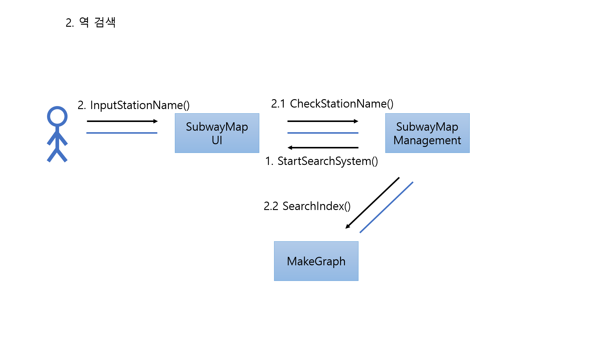
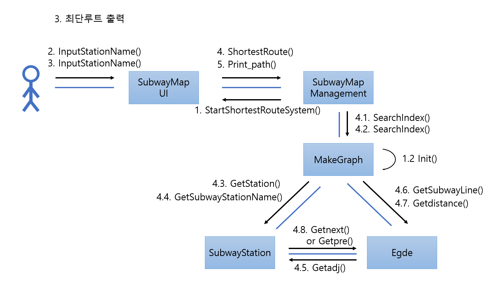

# SubwayMapProject

## 프로젝트 소개 (Find_Shortest_Way)
수도권 지하철의 전체 역을 대상으로  
해당역부터 해당역까지의 최단시간, 최소환승루트를 표현하는 프로그램이다.  
급행열차는 생각하지 않았으며 소요시간은 서울교통공사 사이버 스테이션의 열차정보를 통해 알아내었다.  


## 프로그램 개요
1. 사용할 언어 : C++  
2. 사용할 자료구조 : Double Linked List  
3. 사용할 알고리즘 : Dijkstra algorithm using Priority Queue  


## Requirement List
1. 출발역, 도착역을 입력하는 화면을 보여준다.  
2. 두 역 사이의 최단거리를 보여준다.  

## Step-by-step description
1. 지하철 최단거리 프로그램 실행  
 + system
  + (1) 지하철 노선도 프로그램의 초기화면 보여주기  (SubwayMapUI 만들기)  
    (3) 지하철 노선도 프로그램 실행  
 - user
  - (2) 확인버튼 클릭  


2. 최단거리 출력
 + system
  + (1) 시작역 입력 메세지 출력  
    (3) 도착역 입력 메세지 출력  
    (5) 최단시간루트는 다음과 같습니다를 출력하고 최단거리와 시간을 출력  

 - user
  - (2) 시작역 입력  
    (4) 도착역 입력  

 * Alternatives
  * 시작역과 도착역 중 둘 중 하나가 없는 역일 경우 해당 역은 존재하지 않습니다를 출력하고 프로그램을 종료한다.  


## Communication diagram




## Class definition


## 주석 양식  
1. 클래스 주석  

```c
/*
 클래스 이름 :
 클래스 기능 : 
 */
```

2. 함수 주석  

```c
/*
 함수 이름 :
 함수 기능 :
 인자 : 
 반환값 : 
 */
```

**고민한 점**  
SubwayStation 객체는 vertex만  
멤버변수는 역 이름만  
Edge객체 따로 만들어 vertex와 vertex를 이어주는 방식으로 하자  
멤버변수는 호선, 출발역, 도착역, 거리, next, pre,  

역 객체를 엣지 객체로 이어주고  

관리 객체에서 이 객체들을 전부 멤버변수로 가진다.  
환승여부는 관리객체에서 edge의 호선이 변했는지 체크하는 함수로 대체하자  


**예외상황**  
경의중앙선의 임진강역은 1일 3회 운행으로 문산역으로 밖에 운행을 하지 않음으로 제외한다.  
경의중앙선 가좌-신촌-서울역 또한 1시간 1회 운행이므로 제외한다.  
경춘선의 광운대역도 이와 비슷함으로 제외함  
1호선 광명, 서동탄역도 비슷하여 제외함  


**SubwayStation, Edge 객체들 간의 포인터 정리**  
소요산 <-> line 1, 4 <-> 동두천  
